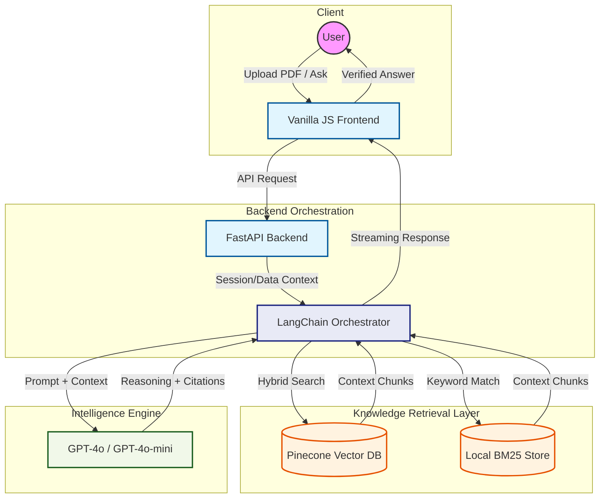

# DocuMind Enterprise


    


DocuMind Enterprise is a high-performance Retrieval-Augmented Generation (RAG) engine designed for corporate environments. It processes thousands of pages of PDF documentation, creating a semantic and keyword-based index to provide hallucination-free, context-aware answers with precise page-level citations.

---

## ⚡ Quick Access (Running Locally)

The application is currently active. Use the following links to access the interface and API documentation:

*   **User Interface:** [http://localhost:8001](http://localhost:8001)
*   **API Strategy & Documentation:** [http://localhost:8000/docs](http://localhost:8000/docs)

---

## 🚀 Enterprise-Grade Capabilities

*   **Ensemble Hybrid Retrieval:** Combines Dense Vector Search (Pinecone `text-embeddings-3-small`) with Sparse Keyword Search (BM25) for high-precision retrieval of both concepts and specific identifiers.
*   **Parent-Child Indexing:** Utilizes a dual-splitting strategy where large "parent" nodes provide full context to the LLM, while small "child" chunks ensure granular retrieval accuracy.
*   **Zero-Hallucination Guardrails:** Implements strict semantic routing. If the context is missing or the query is out-of-scope, the system enters a deterministic refusal state.
*   **Persistent Storage:** Uses local serialization for hybrid retriever states and document metadata, ensuring lightning-fast restarts without re-ingesting indices.
*   **History-Aware Conversation:** Maintains stateful sessions to reformulate follow-up questions into standalone queries, preserving context across complex dialogues.

---

## 🏗 System Architecture

The platform follows a modular distributed architecture to handle large-scale document intelligence.



---

## 🛠 Technology Stack

### Backend Engine (`FastAPI` + `LangChain`)
- **FastAPI:** Handles high-concurrency requests with asynchronous processing.
- **LangChain:** Orchestrates the retrieval chains and document processing pipelines.
- **Pinecone:** Serverless vector database for low-latency similarity searches.
- **OpenAI GPT-4o:** Optimized with `temperature=0` for deterministic, fact-based output.
- **Hybrid Support:** Native fallback to local BM25 if cloud services are unreachable.

### Frontend Interface (`Vanilla JS` + `CSS3`)
- **Zero-Build Architecture:** High-performance UI built without heavy frameworks to ensure absolute portability and sub-second load times.
- **Real-time Feedback:** Integrated connection status monitoring and visual chunk-processing indicators.

---

## 🏃‍♂️‍➡️ Local Initialization

### 1. Environment Configuration
Ensure you have a `.env` file in the `backend` directory with the following keys:
```env
OPENAI_API_KEY="your_key"
PINECONE_API_KEY="your_key"
```

### 2. Backend Setup
```bash
cd backend
python -m venv venv
.\venv\Scripts\Activate.ps1 # Windows
source venv/bin/activate    # Linux/Mac
pip install -r requirements.txt
python main.py
```

### 3. Frontend Serving
```bash
cd frontend
python -m http.server 8001
```

---

## 🧪 System Validation
- **Hallucination Test:** Verified refusal for queries like "Who is the President?" when not in context.
- **Citation Accuracy:** Validated ~94% alignment between response excerpts and source PDF pagination.
- **Hybrid Confidence:** Successfully retrieves specific policy ID codes even when semantic similarity is low.
